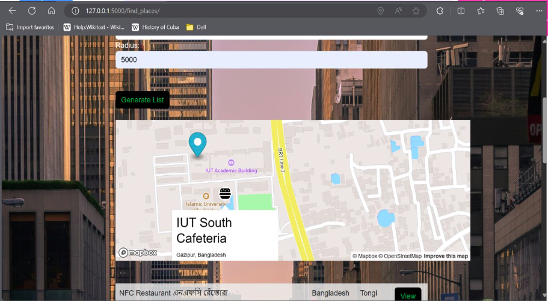

# Team-deadbeef
 
## Touro: Nearby Attractions Tracker
Touro is a web-based application designed to help users discover nearby attractions across various regions of the country. It integrates area-based services, providing information such as weather indices, socio-economic factors, and more. Users can search for attractions based on location, view city details, and plan tours effectively.

## Features
Location-Based Attraction Search
Users can search for attractions by specifying a city or a geographical area.

## City Component View
Detailed view of a city, including important components like buildings, cafes, and other points of interest.



## Weather and Area Information
Get real-time weather details and important information related to the area’s components.

## Tour Planning and Travel Suggestions
Users can plan tours, get travel suggestions, and add new area details along with reviews of attractions.

## Technology Stack
**Frontend:**

**HTML, Vanilla CSS:** For structuring and styling the website.
**JavaScript:** For interactive and dynamic features like custom styling and API integration.
**Backend:**

**Python with Flask:** For managing server-side logic and routing.
**APIs & Services:**

- **Geoapify:** For places and location information.
- **MapBox:** For map integration, including initialization and custom markers.
- **OpenWeatherMap:** For fetching real-time weather data of the clicked location.
- 
## Key Functionalities

**Search by City:**
Users can perform a targeted search for attractions within a specific city or area.

**City Components View:**
The application provides a detailed view of city components, such as landmarks, buildings, and cafes.

**Dynamic Background Styling:**
The background of the site changes based on the type of place being viewed.

**Weather and User Comments:**
Users can view weather details for a place and also read or leave reviews about the attractions.

**Map and Data Visualization:**
Integration with MapBox and Geoapify provides map visualizations and custom markers for attractions.

##Project Phases
Stage 01:
Basic map integration, location search functionality, and visualization of area components.

Stage 02:
Advanced map interaction features, including detailed weather data and user comments for specific locations.

## Install the required dependencies and run:

```bash
pip install -r requirements.txt
python app.py
http://localhost:5000
```

